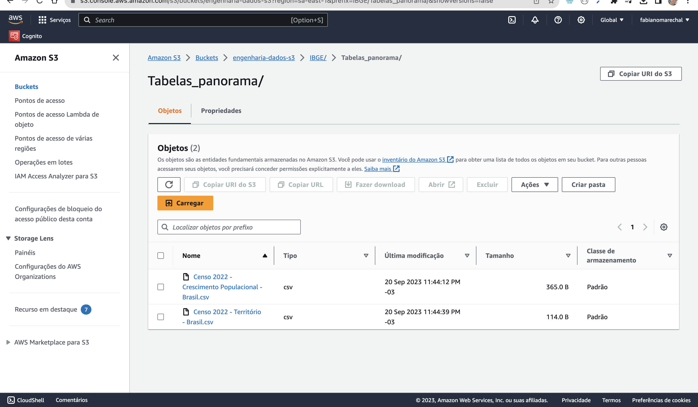
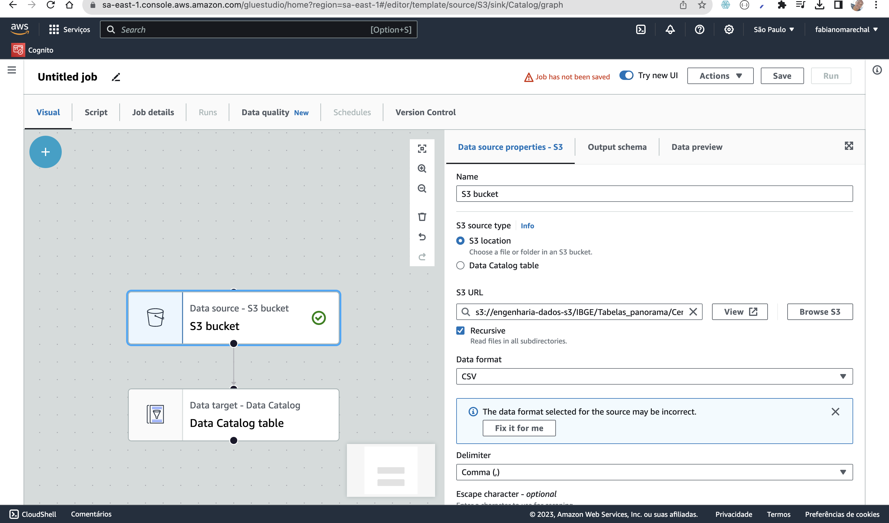

# MVP Engenharia de dados
Minha idéia inicialmente é buscar repostas a perguntas acerca do cenário econômico no país.
Para isso avalio que precisaremos alistar por municipio as médias, desvios padrões e variâncias das seguintes váriaves:

1. Crescimento econômico
3. Taxa de desemprego
4. PIBs
5. Taxas de Inflação
6. Dívida pública
7. Serviços financeiros disponíveis
8. Distribuição de renda

## Busca dos dados
Inicialmente começarei a pesquisa através do portal do [IBGE - Instituto Brasileiro de Geografia e Estatística](https://www.ibge.gov.br/)

[ ] Existe alguma licença de uso para as bases?

## Coleta
- Criação de bucket no s3 para armazenar arquivos CSVs

---

[Bases Estatística econômicas](https://www.ibge.gov.br/estatisticas/economicas/contas-nacionais/9088-produto-interno-bruto-dos-municipios.html?=&t=downloads)

## Modelagem e Documentação
Notebook para analise e modelagem

## Carga

## Análise
    a. Qualidade dos dados
    b. Solução do Problema

### Dificuldades encontrados e possíveis implementações futuras

A primeira pedra no caminho foi que o arquivo de texto contendo os dados econômicos dos municípios estavam em texto puro com um PDF contendo o layout indicando as posições dos campos. Precisei portanto elaborar um código pra fazer a conversão e importação.