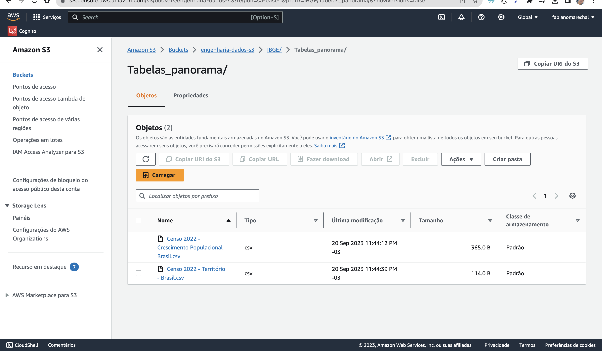

# MVP Engenharia de dados
Minha idéia inicialmente é buscar repostas a perguntas acerca do cenário econômico no país.
Para isso avalio que precisaremos encontrar as médias, desvios padrões e variâncias das seguintes váriaves:

1. Crescimento econômico
2. PIBs
3. Taxas de Inflação
4. Serviços financeiros disponíveis
5. Distribuição de renda

## Busca dos dados
Inicialmente começarei a pesquisa através do portal do [IBGE - Instituto Brasileiro de Geografia e Estatística](https://www.ibge.gov.br/)

## Coleta
- Criação de bucket no s3 para armazenar arquivos Parquets

---
- Configuração do JOB no Glue para ler os Parquets no S3 e carregar no DataCatalog

[Bases Estatística econômicas](https://www.ibge.gov.br/estatisticas/economicas/contas-nacionais/9088-produto-interno-bruto-dos-municipios.html?=&t=downloads)

## Modelagem e Documentação
Criei um Notebook para analise dos dados com PySpark - [Link do Github](https://github.com/fabianomarechal/engenharia-de-dados.git) 
Converti o txt para arquivo parquet a ser usado no Glue Job utilizando a documentação em PDF do layout dos dado.

## Carga
- Criação da base de dados no redshift

- Transformação e Carregamento dos dados

## Análise
    a. Qualidade dos dados
        Todos os dados vieram como campo texto e precisaram ser convertidos para os tipos apropriados de dados para poderem ser usados nas agregações e análises. A base escolhida tinha um PDF detalhando o mapeamento dos campos o que ajudou na construção do algoritmo para extração/transformação. 

    b. Solução do Problema
        Com o uso do QuickSight foi possível conectar no Redshift e criar painéis interativos para análise e visualização dos dados com alta qualidade e desempenho viabilizando o projeto para um dashboard com os dados do crescimento econômico e comparações através dos anos e diversos estados do país.

### Dificuldades encontrados e possíveis implementações futuras

A primeira pedra no caminho foi que o arquivo de texto contendo os dados econômicos dos municípios estavam em texto puro com um PDF contendo o layout indicando as posições dos campos. Precisei portanto elaborar um código pra fazer a conversão e importação.

A segunda dificuldade foi configurar os permissionamentos no IAM da AWS para permitir o JOB ler os arquivos parquet e carregar no DataCatalog e Redshift.

Futuramente pretendo implementar um aplicativo dinâmico utilizando uma api para reutilizar os dados e trazer outras fontes de dados relacionando taxa de desemprego e custo de vida pra cruzar com os dados econômicos e gerar novos insights.
